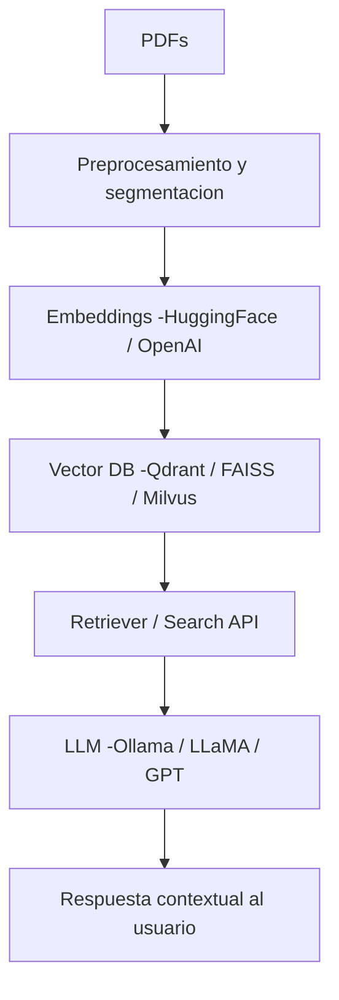

# 🧠 RAG-Scale: Retrieval-Augmented Generation at Scale

> **Caso industrial real**: Implementación de un sistema RAG (Retrieval-Augmented Generation) capaz de manejar **cientos o miles de documentos (PDFs)** para consulta inteligente y generación contextual de respuestas.

---

## 🚀 Objetivo

Este proyecto demuestra cómo construir un **sistema RAG escalable** con **FastAPI + LangChain + Qdrant + LLM (Ollama o OpenAI)** para entornos reales donde se requiere consultar grandes volúmenes de documentos técnicos o científicos.

Se incluyen técnicas de **preprocesamiento, embeddings distribuidos, almacenamiento vectorial y recuperación semántica optimizada**.

---

## 🏗️ Arquitectura general



## Estructura del Proyecto

```bash
RAG-Scale/
│
├── data/
│   ├── pdfs/                     # Carpeta con tus 100+ PDFs
│   └── processed/                # Textos extraídos y limpiados
│
├── src/
│   ├── ingest/
│   │   ├── extract_text.py       # Extrae texto de PDFs
│   │   ├── clean_text.py         # Limpia texto
│   │   ├── chunk_text.py         # Divide en chunks
│   │   └── pipeline_ingest.py    # Pipeline de ingestión completo
│   │
│   ├── embeddings/
│   │   ├── embedder.py           # Crea embeddings HuggingFace
│   │   └── vector_store.py       # Conexión Qdrant + carga de vectores
│   │
│   ├── rag/
│   │   ├── retriever.py          # Recuperación semántica
│   │   └── generator.py          # LLM que genera respuestas
│   │
│   ├── api/
│   │   └── main.py               # FastAPI con /ask
│   │
│   └── utils/
│       └── logger.py             # Logging centralizado
├── create_vector_db.py
├── requirements.txt
├── README.md
└── .env                          # Variables (Qdrant, model, rutas)
```